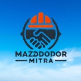

<table>
  <tr>
    <td></td>
    <td style="text-align: center; font-weight: bold; font-size: 24px;">MazdoorMitra</td>
    <td></td>
  </tr>
</table>

**Project Idea**

MazdoorMitra is a digital platform aimed at revolutionizing labor management for brokers who hire workers from labor addas and distribute them to various worksites. By digitizing the manual processes, MazdoorMitra makes it easier for brokers to manage labor records, track attendance, handle payments, and communicate with both workers and employers in real-time. The application simplifies operations for labor brokers and enhances the productivity of laborers, contributing to improved transparency, efficiency, and scalability in labor management.

**Objectives**

- To digitize labor management for brokers through an intuitive mobile platform.
- To provide e-KYC verification for workers and employers, ensuring identity and accountability.
- To facilitate real-time attendance tracking and worksite management.
- To simplify financial processes by enabling digital payment transfers and reducing dependency on cash.
- To improve communication between brokers, laborers, and employers across multiple worksites.
- To increase the efficiency of labor brokers, enabling them to manage more worksites and workers.

**Methodology**

- Develop a mobile application that labor brokers can easily use to record laborers’ details, including work assignments, attendance, and payments.
- Incorporate real-time updates for attendance, worksite progress, and payment status.
- Use digital verification tools to ensure worker identity and reduce fraud.
- Partner with financial service providers to enable secure, instant digital payment transfers.
- Include messaging services within the app to enhance direct communication between brokers and workers at different worksites.
- Ensure the app can handle an increasing number of brokers, worksites, and laborers.

**Expected Outcomes**

- Increased operational efficiency for labor brokers, allowing them to manage more laborers and worksites.
- Improved transparency in worker attendance and payment processes, reducing mismanagement and delays.
- Enhanced communication between brokers and laborers, minimizing miscommunication and delays.
- Digital financial transactions reducing cash-related risks and errors.
- Empowerment of laborers through better tracking of their work and payments.

**Project Development Journey**

We have been working on the "MazdoorMitra" project for the past 8 months, during which we conducted extensive fieldwork to understand the difficulties faced by contractors and laborers in managing their operations. Through this hands-on research, we identified critical pain points such as the lack of a structured digital system, difficulties in tracking attendance, managing payments, and communicating across multiple sites.

Using the insights gained from the field, we have carefully developed our application to streamline these tasks. We are currently in the final stages of development, with the core functionality implemented. Our next steps include deployment, user testing, and purchasing tools to scale the platform to a larger user base.

MazdoorMitra is designed to provide a seamless digital experience for contractors and laborers, making it easier for them to collaborate, track progress, and manage payments—all in real time. We are excited about bringing this solution to life and making a real impact in the field of labor management.

**Meet Our Team Mentor:**

- **Venkat Ram Reddy Ganuthula**

  Assistant Professor

  School of Management & Entrepreneurship

  Indian Institute of Technology Jodhpur <https://research.iitj.ac.in/researcher/venkat-ram-reddy-ganuthula>

**Team Leader:**

- **Vinayak Raj Ranjan**

  Final Year B.Tech Student

  Indian Institute of Technology Jodhpur

  <https://www.linkedin.com/in/vinayak-raj-ranjan-37537222a/>

**Team Member 1:**

- **Shaik Mohammed Touseef**

  Final Year B.Tech Student

  Indian Institute of Technology Jodhpur

  <https://www.linkedin.com/in/shaikmohammedtouseef/>
>
